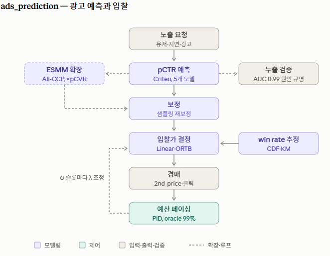
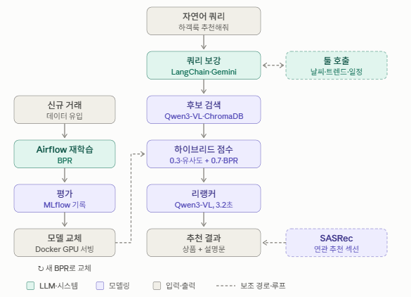
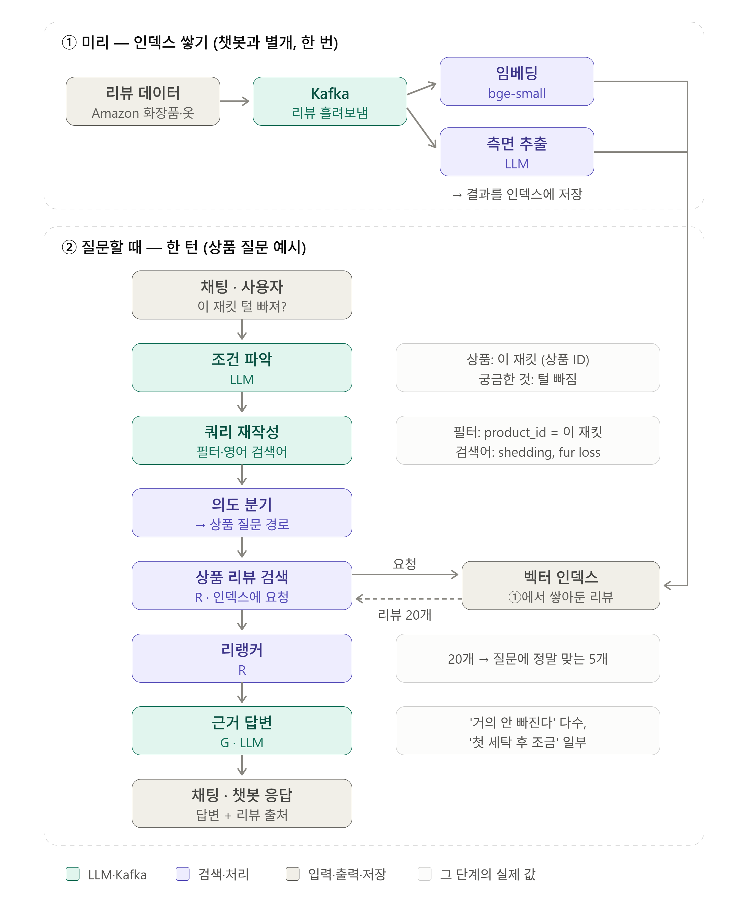
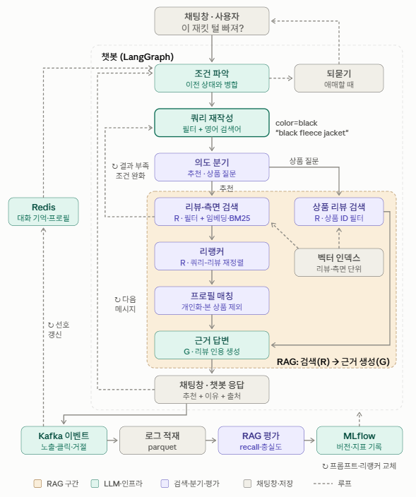
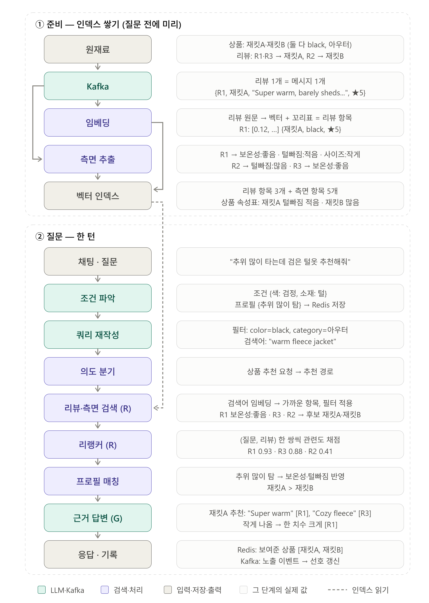
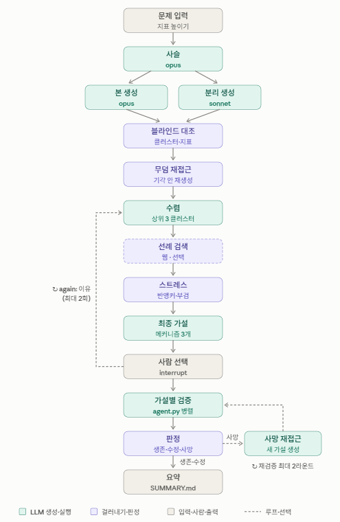
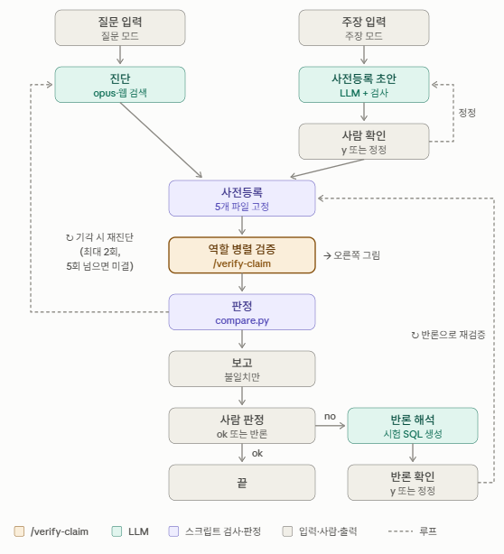
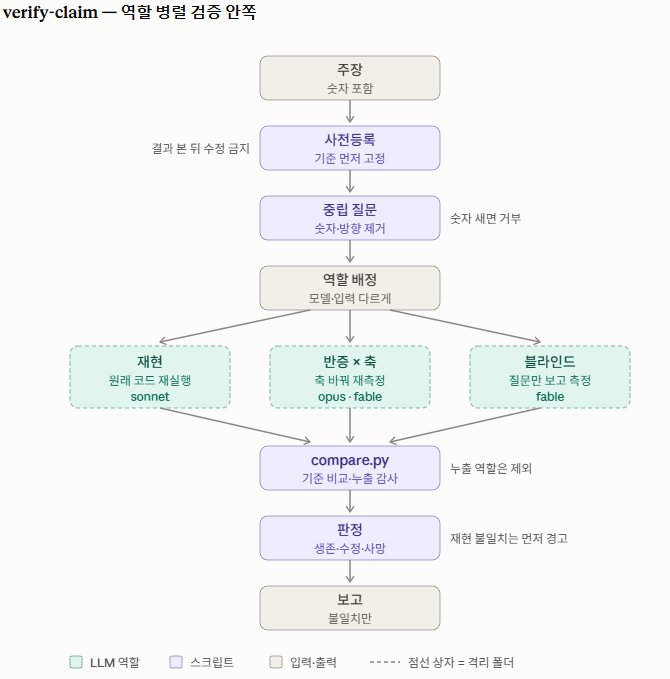

## 안녕하세요 👋

추천, 광고 모델링과 LLM 에이전트까지 E2E로 만드는 걸 선호합니다.
모델을 만드는 데서 끝내지 않고, 서빙하고, 검증합니다.

- 관심 분야: 개인화 추천 시스템, CTR/CVR 예측, 입찰 최적화, RAG, LLM 에이전트
- 주로 쓰는 것: Python, PyTorch, LangGraph, LangChain, MLflow, Airflow, Docker, Kafka, Redis

 

## Projects

<b>ads_prediction</b>: CTR/CVR 예측부터 입찰, 예산 페이싱까지

 

광고 시스템에서 예측, 입찰, 예산 제어로 이어지는 흐름을 공개 데이터(Criteo, Ali-CCP, iPinYou)로 재현해 봤습니다.

- Criteo 4,580만 건으로 LR, FM, DeepFM, DCN v2, AutoInt 다섯 가지 CTR 모델을 비교했습니다. 데이터는 시간순으로 나눴고, AUC는 AutoInt가 0.7986으로 가장 높았지만 추론은 DCN v2가 단건 기준 2.5배 빨랐습니다.
- Ali-CCP에서는 ESMM으로 CTR과 CVR을 같이 학습해서 샘플 선택 편향과 데이터 희소성 문제를 다뤘습니다.
- 네거티브 다운샘플링으로 학습한 뒤에는 확률을 다시 보정해서 과대입찰을 막았습니다.
- iPinYou에서 AUC가 0.99로 너무 높게 나와서 누출을 의심했고, 피처를 하나씩 빼 보면서 원인 피처를 찾았습니다. 벤치마크 논문 결과를 재현해서 누출이 아니라 정상 신호라는 것도 확인했습니다.
- win rate를 CDF와 KM으로 추정해 ORTB로 입찰했고, 시장가가 바뀌면서 고정 λ가 무너지는 구간은 PID 페이싱으로 oracle의 99%까지 회복했습니다.

[repository](https://github.com/sws95/ads_prediction)

<b>fashion-recommend-llm</b>: 멀티모달 검색과 협업필터링을 섞은 옷 추천

 

H&M 실거래 데이터 3,178만 건으로 만든 자연어 기반 옷 추천 시스템입니다.

- 검색은 Qwen3-VL 멀티모달 임베딩과 ChromaDB, BM25를 같이 씁니다.
- 임베딩 유사도와 BPR 점수를 섞어서 유저마다 순서를 다시 정하고, 연관 추천은 SASRec으로 따로 만들었습니다.
- Qwen3-VL 리랭커는 이미지 해상도를 줄여서 추론 시간을 16초에서 3.2초로 줄였습니다.
- 쿼리는 LangChain과 Gemini 에이전트가 날씨, 트렌드, 일정 툴을 불러서 보강합니다.
- MLflow로 실험을 기록하고, Docker로 GPU 서빙을 하고, Airflow로 새 데이터가 들어오면 BPR을 다시 학습해서 평가한 뒤 모델을 교체합니다.
- 임베딩 모델은 CLIP과 비교했을 때 Qwen3-VL이 HitRate@5 기준 48% 높았고, 두 점수를 섞는 비율(α)도 실험으로 정했습니다.

[repository](https://github.com/sws95/fashion-recommend-llm)

<b>product-extraction-chatbot</b>: 상품 정보 추출과 리뷰 기반 상담 챗봇 (진행 중)

 

Amazon Reviews 2023의 화장품과 옷 리뷰를 근거로 상품을 추천하고 질문에 답하는 RAG 챗봇을 만들고 있습니다.

- 상품 정보도 LLM으로 다시 정리합니다. Amazon 상품 데이터는 제목에 검색 키워드가 뒤섞여 있고 설명이 비어 있는 경우가 많아서, 제목과 설명(이미지가 있으면 이미지까지)에서 종류, 소재, 색상, 용량 같은 속성을 정해진 값으로 뽑아 검색 필터와 추천 피처로 씁니다.
- 리뷰에서는 "보온성 좋음", "털 빠짐 적음" 같은 측면을 정해진 값으로 뽑아서 검색 단위와 상품 속성으로 씁니다.
- 검색은 필터와 임베딩(bge-small), BM25를 섞어서 하고, 크로스인코더 리랭커로 한 번 더 거른 뒤 리뷰를 인용해서 답합니다.
- 대화 흐름은 LangGraph로 짰습니다. 이전 조건과 합치기, 검색어 다시 쓰기, 추천인지 상품 질문인지 나누기, 되묻기, 결과가 적으면 다시 검색하기까지 들어갑니다. 대화 상태와 프로필은 Redis에 둡니다.
- 새 리뷰는 Kafka로 받아서 임베딩과 측면 추출을 따로 처리하고, 프롬프트를 바꾸면 예전 리뷰도 다시 돌릴 수 있게 했습니다.
- 대화에서 나온 클릭과 거절은 선호에 반영하고, RAG 성능(recall, 충실도)은 MLflow에 남겨서 프롬프트나 리랭커를 바꿀 때 비교합니다.

인덱스 쌓기 (리뷰 수집, 스트리밍)

 

챗봇 그래프 (LangGraph + RAG)

 

예시: "추위 많이 타는데 검은 털옷 추천해줘"

 

[repository](https://github.com/sws95/product-extraction-chatbot)

<b>LLM 분석 에이전트 (LangGraph)</b>: 가설 생성, 분석, 독립 검증 세 단계

 

업무 분석을 돕기 위해 만든 에이전트들입니다. 업무 데이터 위에서 돌아가서 코드는 올리지 않고 구조만 적었습니다.

/idea (가설 생성)

 

opus와 sonnet이 따로 아이디어를 내고, 어디서 나온 안인지 가린 채로 묶어서 같은 얘기를 반복하는 비율과 한쪽으로 쏠리는 정도를 숫자로 봅니다. 예전에 기각된 안은 가정을 바꿔서 다시 시도하고, 비슷한 선례를 찾아본 뒤 "이 숫자가 안 나오면 버린다"는 기준까지 붙여서 검증할 가설 세 개로 좁힙니다. 생성 단계는 이전 기억에 끌려가지 않도록 메모리를 볼 수 없는 환경에서 돌립니다.

분석 에이전트 (질문에서 결론까지)

 

질문을 받으면 원인을 진단하고, 검증 기준을 먼저 정한 다음 독립 검증을 거쳐서 보고합니다. 검증에서 기각되면 다른 방법으로 다시 진단하고, 사람이 반론을 달면 그걸 실행할 수 있는 SQL과 기준으로 바꿔서 다시 검증합니다.

독립 검증 (결론을 숨기고 따로 재기)

 

에이전트끼리 토론시키지 않고 역할별로 따로 돌린 뒤, 판정은 스크립트가 합니다.

- 재현: 원래 코드를 다시 돌려서 계산 실수를 찾습니다.
- 반증: 데이터 원천, 지표 정의, 음성 대조, 부분집합을 바꿔서 다시 재봅니다.
- 블라인드: 원래 숫자를 모른 채 질문만 보고 잽니다.
- 판정 기준은 실행 전에 정해두고, 보면 안 되는 파일에 접근했는지는 로그로 확인합니다.

